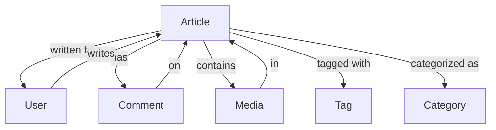

# Article [OBJ-ARTICLE-001]

## Overview
The Article object represents long-form written content focused on personal development, inspiration, or expertise demonstration. Articles are the primary content type for in-depth exploration of topics.

## Schema

### Properties
| Name | Type | Required | Description | Default |
|------|------|----------|-------------|---------|
| id | UUID | Yes | Unique identifier for the article | Auto-generated |
| title | String | Yes | Article title | null |
| slug | String | Yes | URL-friendly version of title | Auto-generated |
| content | String | Yes | Main article content (HTML/Markdown) | null |
| excerpt | String | Yes | Short summary of the article | null |
| authorId | UUID | Yes | Reference to User who created the article | null |
| status | String | Yes | Publication status (draft, published, archived) | 'draft' |
| publishedAt | DateTime | No | When the article was published | null |
| featuredImage | String | No | URL of the featured image | null |
| readingTime | Number | Yes | Estimated reading time in minutes | Auto-calculated |
| viewCount | Number | Yes | Number of times article was viewed | 0 |
| createdAt | DateTime | Yes | When the article was created | Auto-generated |
| updatedAt | DateTime | Yes | When the article was last updated | Auto-generated |

### Methods
| Name | Parameters | Return Type | Description |
|------|------------|-------------|-------------|
| publish | none | Boolean | Publishes the article |
| unpublish | none | Boolean | Unpublishes the article |
| updateContent | content: String | Article | Updates article content |
| incrementViews | none | Number | Increments view count |
| getRelatedArticles | limit: Number | Article[] | Gets related articles |

### Relationships
| Type | Related Object | Cardinality | Description |
|------|----------------|--------------|-------------|
| belongs-to | User | N:1 | Article belongs to one author |
| has-many | Comment | 1:N | Article can have multiple comments |
| has-many | Media | 1:N | Article can have multiple media items |
| belongs-to-many | Tag | N:N | Article can have multiple tags |
| belongs-to-many | Category | N:N | Article can belong to multiple categories |

## Relationship Diagram


## Validation Rules
1. Title must be between 5-100 characters
2. Content must be at least 500 characters
3. Excerpt must be between 50-200 characters
4. Slug must be unique and URL-friendly
5. Author must exist and be active

## Constraints
- Only published articles are publicly visible
- Articles cannot be deleted, only archived
- Content updates require author approval
- Media must be properly attributed

## Examples
```javascript
// Creating a new article
const newArticle = new Article({
  title: '10 Tips for Personal Growth',
  content: '# Introduction\n\nPersonal growth is...',
  excerpt: 'Learn the essential tips for personal development...',
  authorId: 'user-uuid',
  tags: ['personal-development', 'growth'],
  categories: ['self-improvement']
});

// Publishing an article
article.publish();

// Updating article content
article.updateContent('# Updated Content\n\nNew content here...');
```

## Notes
- Articles support Markdown formatting
- Content is versioned for tracking changes
- SEO metadata is automatically generated
- Reading time is estimated based on content length

## Version History
- 2024-02-13: Initial definition
- 2024-02-13: Added relationship diagram 