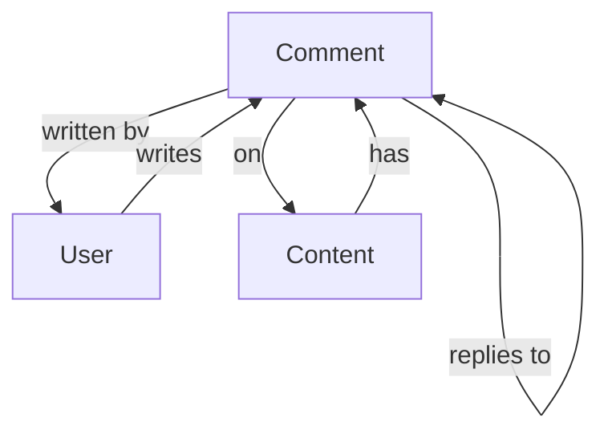

# Comment [OBJ-COMMENT-001]

## Overview
The Comment object represents user feedback, discussions, and interactions on content. Comments facilitate community engagement and provide valuable insights.

## Schema

### Properties
| Name | Type | Required | Description | Default |
|------|------|----------|-------------|---------|
| id | UUID | Yes | Unique identifier for the comment | Auto-generated |
| content | String | Yes | Comment content (text/HTML) | null |
| authorId | UUID | Yes | Reference to User who created the comment | null |
| parentId | UUID | No | Reference to parent comment (for replies) | null |
| contentType | String | Yes | Type of content being commented on (article, post, tutorial) | null |
| contentId | UUID | Yes | ID of the content being commented on | null |
| status | String | Yes | Comment status (pending, approved, rejected) | 'pending' |
| likeCount | Number | Yes | Number of likes | 0 |
| replyCount | Number | Yes | Number of replies | 0 |
| createdAt | DateTime | Yes | When the comment was created | Auto-generated |
| updatedAt | DateTime | Yes | When the comment was last updated | Auto-generated |

### Methods
| Name | Parameters | Return Type | Description |
|------|------------|-------------|-------------|
| approve | none | Boolean | Approves the comment |
| reject | reason: String | Boolean | Rejects the comment |
| like | userId: UUID | Boolean | Adds a like from a user |
| unlike | userId: UUID | Boolean | Removes a like from a user |
| reply | content: String, authorId: UUID | Comment | Creates a reply to this comment |
| getReplies | limit: Number | Comment[] | Gets comment replies |

### Relationships
| Type | Related Object | Cardinality | Description |
|------|----------------|--------------|-------------|
| belongs-to | User | N:1 | Comment belongs to one author |
| belongs-to | Comment | N:1 | Comment can belong to a parent comment |
| has-many | Comment | 1:N | Comment can have multiple replies |
| polymorphic | Content | N:1 | Comment can belong to different content types |

## Relationship Diagram


## Validation Rules
1. Content must be between 1-1000 characters
2. Author must exist and be active
3. Content type must be valid
4. Content ID must exist
5. Parent comment must exist if parentId is provided

## Constraints
- Comments require moderation before public display
- Nested replies are limited to 3 levels
- Users can't like their own comments
- Content authors can pin comments

## Examples
```javascript
// Creating a new comment
const newComment = new Comment({
  content: 'Great article! Very insightful.',
  authorId: 'user-uuid',
  contentType: 'article',
  contentId: 'article-uuid'
});

// Replying to a comment
const reply = comment.reply(
  'Thanks for your feedback!',
  'author-uuid'
);

// Approving a comment
comment.approve();
```

## Notes
- Comments support basic text formatting
- Moderation is required for new comments
- Notifications are sent for replies
- Comment threading is supported

## Version History
- 2024-02-13: Initial definition
- 2024-02-13: Added relationship diagram 