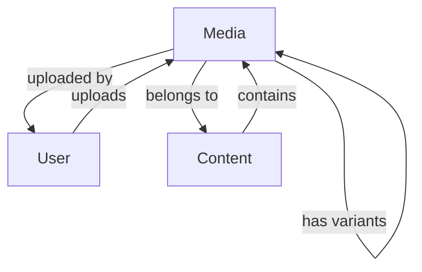

# Media [OBJ-MEDIA-001]

## Overview
The Media object represents images, videos, documents, and other media files used throughout the platform. It manages media storage, optimization, and delivery.

## Schema

### Properties
| Name | Type | Required | Description | Default |
|------|------|----------|-------------|---------|
| id | UUID | Yes | Unique identifier for the media | Auto-generated |
| type | String | Yes | Media type (image, video, document, audio) | null |
| title | String | Yes | Media title | null |
| description | String | No | Media description | null |
| url | String | Yes | URL to access the media | null |
| thumbnailUrl | String | No | URL for media thumbnail | null |
| size | Number | Yes | File size in bytes | 0 |
| mimeType | String | Yes | MIME type of the media | null |
| width | Number | No | Width of image/video in pixels | null |
| height | Number | No | Height of image/video in pixels | null |
| duration | Number | No | Duration of video/audio in seconds | null |
| uploaderId | UUID | Yes | Reference to User who uploaded the media | null |
| contentType | String | Yes | Type of content the media belongs to | null |
| contentId | UUID | Yes | ID of the content the media belongs to | null |
| status | String | Yes | Media status (processing, active, archived) | 'processing' |
| createdAt | DateTime | Yes | When the media was created | Auto-generated |
| updatedAt | DateTime | Yes | When the media was last updated | Auto-generated |

### Methods
| Name | Parameters | Return Type | Description |
|------|------------|-------------|-------------|
| optimize | options: Object | Boolean | Optimizes media for delivery |
| generateThumbnail | size: Object | String | Generates thumbnail for media |
| archive | reason: String | Boolean | Archives the media |
| restore | none | Boolean | Restores archived media |
| getVariants | type: String | Media[] | Gets different size variants |

### Relationships
| Type | Related Object | Cardinality | Description |
|------|----------------|--------------|-------------|
| belongs-to | User | N:1 | Media belongs to one uploader |
| polymorphic | Content | N:1 | Media can belong to different content types |
| has-many | Media | 1:N | Media can have multiple variants |

## Relationship Diagram


## Validation Rules
1. Title must be between 1-100 characters
2. File size must be within limits (varies by type)
3. MIME type must be allowed
4. Uploader must exist and be active
5. Content type and ID must be valid

## Constraints
- Images are automatically optimized
- Videos are transcoded for different qualities
- Documents are scanned for malware
- Media cannot be deleted, only archived

## Examples
```javascript
// Uploading a new image
const newMedia = new Media({
  type: 'image',
  title: 'Personal Development Workshop',
  description: 'Photo from the workshop',
  url: 'https://example.com/media/image.jpg',
  size: 1024000,
  mimeType: 'image/jpeg',
  width: 1920,
  height: 1080,
  uploaderId: 'user-uuid',
  contentType: 'article',
  contentId: 'article-uuid'
});

// Generating thumbnail
const thumbnailUrl = media.generateThumbnail({
  width: 300,
  height: 200
});

// Optimizing image
media.optimize({
  quality: 80,
  format: 'webp'
});
```

## Notes
- Media is stored in cloud storage
- CDN is used for delivery
- Automatic backup is performed
- Usage analytics are tracked

## Version History
- 2024-02-13: Initial definition
- 2024-02-13: Added relationship diagram 