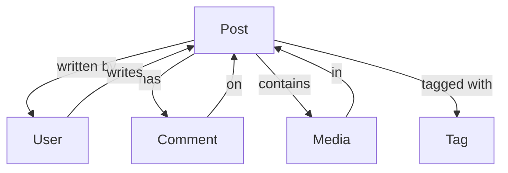

# Post [OBJ-POST-001]

## Overview
The Post object represents short-form content updates, thoughts, and quick insights. Posts are more conversational and immediate compared to Articles, perfect for sharing quick tips, updates, or inspiration.

## Schema

### Properties
| Name | Type | Required | Description | Default |
|------|------|----------|-------------|---------|
| id | UUID | Yes | Unique identifier for the post | Auto-generated |
| content | String | Yes | Post content (text/HTML) | null |
| authorId | UUID | Yes | Reference to User who created the post | null |
| status | String | Yes | Publication status (draft, published, archived) | 'published' |
| publishedAt | DateTime | Yes | When the post was published | Auto-generated |
| mediaUrls | String[] | No | Array of media URLs attached to post | [] |
| likeCount | Number | Yes | Number of likes | 0 |
| shareCount | Number | Yes | Number of shares | 0 |
| createdAt | DateTime | Yes | When the post was created | Auto-generated |
| updatedAt | DateTime | Yes | When the post was last updated | Auto-generated |

### Methods
| Name | Parameters | Return Type | Description |
|------|------------|-------------|-------------|
| like | userId: UUID | Boolean | Adds a like from a user |
| unlike | userId: UUID | Boolean | Removes a like from a user |
| share | platform: String | Boolean | Shares post to specified platform |
| updateContent | content: String | Post | Updates post content |
| getComments | limit: Number | Comment[] | Gets post comments |

### Relationships
| Type | Related Object | Cardinality | Description |
|------|----------------|--------------|-------------|
| belongs-to | User | N:1 | Post belongs to one author |
| has-many | Comment | 1:N | Post can have multiple comments |
| has-many | Media | 1:N | Post can have multiple media items |
| belongs-to-many | Tag | N:N | Post can have multiple tags |

## Relationship Diagram


## Validation Rules
1. Content must be between 1-500 characters
2. Author must exist and be active
3. Media URLs must be valid
4. Tags must be valid and exist

## Constraints
- Posts are published immediately by default
- Content updates are not versioned
- Media must be properly attributed
- Like/Share counts are read-only

## Examples
```javascript
// Creating a new post
const newPost = new Post({
  content: 'Just achieved my daily goal of reading for 30 minutes! 📚 #personaldevelopment',
  authorId: 'user-uuid',
  mediaUrls: ['image-url'],
  tags: ['achievement', 'reading']
});

// Liking a post
post.like('user-uuid');

// Updating post content
post.updateContent('Updated content with new achievement! 🎉');
```

## Notes
- Posts support basic text formatting
- Media can be attached directly
- Posts are designed for quick sharing
- Engagement metrics are tracked

## Version History
- 2024-02-13: Initial definition
- 2024-02-13: Added relationship diagram 