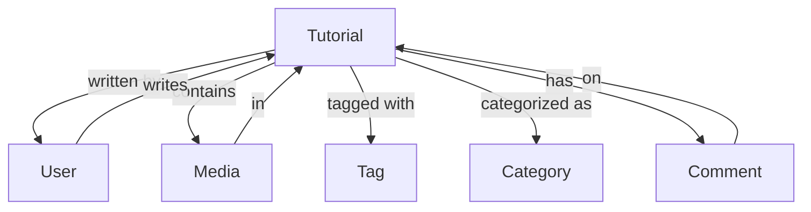

# Tutorial [OBJ-TUTORIAL-001]

## Overview
The Tutorial object represents structured, step-by-step learning content designed to teach specific skills or concepts. Tutorials are interactive and include practical exercises.

## Schema

### Properties
| Name | Type | Required | Description | Default |
|------|------|----------|-------------|---------|
| id | UUID | Yes | Unique identifier for the tutorial | Auto-generated |
| title | String | Yes | Tutorial title | null |
| slug | String | Yes | URL-friendly version of title | Auto-generated |
| description | String | Yes | Detailed description of the tutorial | null |
| difficulty | String | Yes | Difficulty level (beginner, intermediate, advanced) | 'beginner' |
| authorId | UUID | Yes | Reference to User who created the tutorial | null |
| status | String | Yes | Publication status (draft, published, archived) | 'draft' |
| publishedAt | DateTime | No | When the tutorial was published | null |
| estimatedTime | Number | Yes | Estimated completion time in minutes | 0 |
| steps | Object[] | Yes | Array of tutorial steps | [] |
| prerequisites | String[] | No | Required knowledge/skills | [] |
| completionRate | Number | Yes | Percentage of users who complete | 0 |
| createdAt | DateTime | Yes | When the tutorial was created | Auto-generated |
| updatedAt | DateTime | Yes | When the tutorial was last updated | Auto-generated |

### Methods
| Name | Parameters | Return Type | Description |
|------|------------|-------------|-------------|
| publish | none | Boolean | Publishes the tutorial |
| unpublish | none | Boolean | Unpublishes the tutorial |
| addStep | step: Object | Tutorial | Adds a new step |
| updateStep | stepId: UUID, step: Object | Tutorial | Updates a step |
| reorderSteps | stepIds: UUID[] | Tutorial | Reorders tutorial steps |
| trackCompletion | userId: UUID | Boolean | Tracks user completion |
| getProgress | userId: UUID | Number | Gets user progress percentage |

### Relationships
| Type | Related Object | Cardinality | Description |
|------|----------------|--------------|-------------|
| belongs-to | User | N:1 | Tutorial belongs to one author |
| has-many | Media | 1:N | Tutorial can have multiple media items |
| belongs-to-many | Tag | N:N | Tutorial can have multiple tags |
| belongs-to-many | Category | N:N | Tutorial can belong to multiple categories |
| has-many | Comment | 1:N | Tutorial can have multiple comments |

## Relationship Diagram


## Validation Rules
1. Title must be between 5-100 characters
2. Description must be at least 100 characters
3. Must have at least one step
4. Difficulty must be one of: beginner, intermediate, advanced
5. Author must exist and be active

## Constraints
- Only published tutorials are publicly visible
- Steps must be completed in order
- Media must be properly attributed
- Completion tracking is required

## Examples
```javascript
// Creating a new tutorial
const newTutorial = new Tutorial({
  title: 'Getting Started with Personal Development',
  description: 'Learn the basics of personal development...',
  difficulty: 'beginner',
  authorId: 'user-uuid',
  steps: [
    {
      title: 'Introduction',
      content: 'Welcome to personal development...',
      order: 1
    }
  ],
  prerequisites: ['None'],
  tags: ['personal-development', 'basics'],
  categories: ['self-improvement']
});

// Adding a step
tutorial.addStep({
  title: 'Setting Goals',
  content: 'Learn how to set effective goals...',
  order: 2
});

// Tracking completion
tutorial.trackCompletion('user-uuid');
```

## Notes
- Tutorials support rich media content
- Progress is tracked per user
- Steps can include interactive elements
- Completion certificates are available

## Version History
- 2024-02-13: Initial definition
- 2024-02-13: Added relationship diagram 