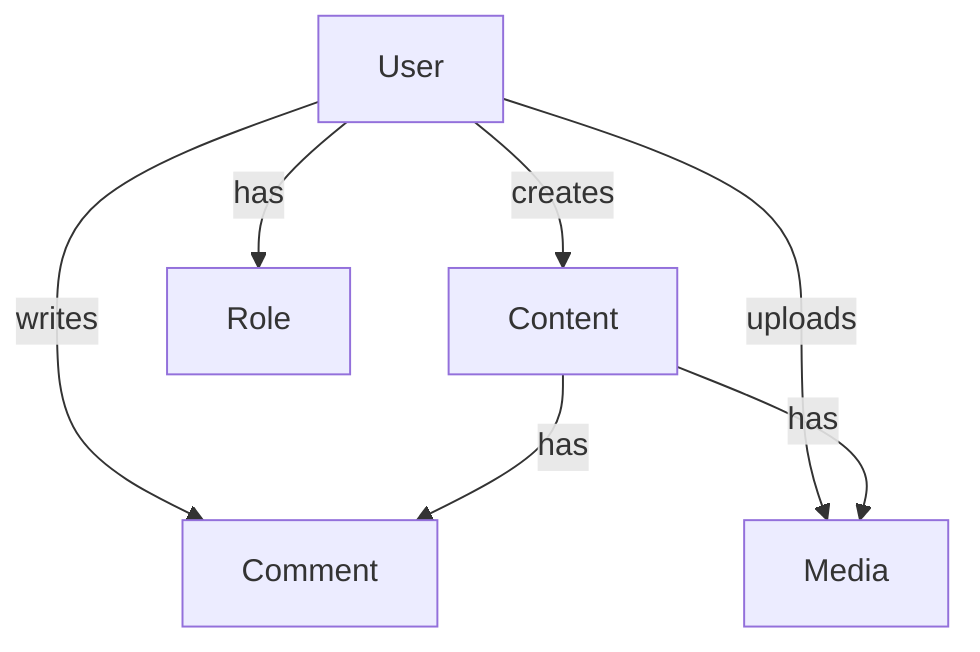

# User [OBJ-USER-001]

## Overview
The User object represents a user of the system. It manages user authentication, profile information, and permissions.

## Schema

### Properties
| Name | Type | Required | Description | Default |
|------|------|----------|-------------|---------|
| id | UUID | Yes | Unique identifier for the user | Auto-generated |
| username | String | Yes | Unique username for login | null |
| email | String | Yes | User's email address | null |
| password | String | Yes | Hashed password | null |
| firstName | String | No | User's first name | null |
| lastName | String | No | User's last name | null |
| role | String | Yes | User's role (admin, author, reader) | 'reader' |
| isActive | Boolean | Yes | Whether the user account is active | true |
| createdAt | DateTime | Yes | When the user was created | Auto-generated |
| updatedAt | DateTime | Yes | When the user was last updated | Auto-generated |

### Methods
| Name | Parameters | Return Type | Description |
|------|------------|-------------|-------------|
| authenticate | password: String | Boolean | Verifies user password |
| updateProfile | profileData: Object | User | Updates user profile information |
| changePassword | oldPassword: String, newPassword: String | Boolean | Changes user password |
| deactivate | reason: String | Boolean | Deactivates user account |
| getFullName | none | String | Returns user's full name |

### Relationships
| Type | Related Object | Cardinality | Description |
|------|----------------|--------------|-------------|
| has-many | Content | 1:N | User can create multiple content items |
| has-many | Comment | 1:N | User can make multiple comments |
| has-many | Media | 1:N | User can upload multiple media files |
| belongs-to | Role | N:1 | User belongs to one role |

## Relationship Diagram


## Validation Rules
1. Username must be unique and between 3-30 characters
2. Email must be unique and valid format
3. Password must be at least 8 characters with mixed case and numbers
4. Role must be one of: admin, author, reader
5. First and last names must be alphabetic only

## Constraints
- User cannot be deleted, only deactivated
- Password must be hashed before storage
- Email verification required for activation
- Role changes require admin approval

## Examples
```javascript
// Creating a new user
const newUser = new User({
  username: 'johndoe',
  email: 'john@example.com',
  password: 'hashedPassword123',
  firstName: 'John',
  lastName: 'Doe',
  role: 'reader'
});

// Updating user profile
user.updateProfile({
  firstName: 'Johnny',
  lastName: 'Doe'
});

// Changing password
user.changePassword('oldPassword123', 'newPassword456');
```

## Notes
- User data is sensitive and requires encryption
- All user actions should be logged
- Profile updates require email verification
- Password resets require security questions

## Version History
- 2024-02-13: Initial definition
- 2024-02-13: Added relationship diagram 