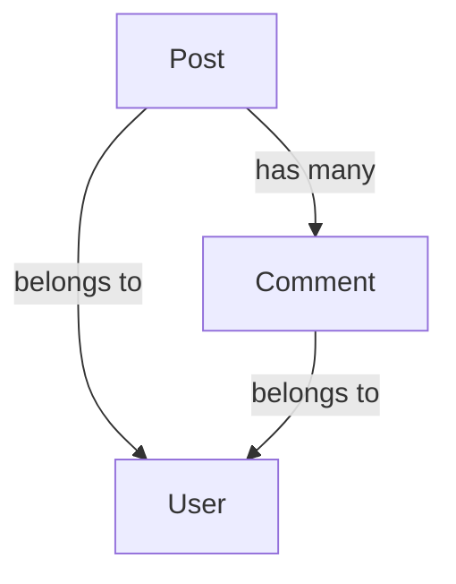

# Object Documentation

This directory contains detailed documentation for all core objects in the system. Each object is defined in its own markdown file following the template structure.

## Object Relationships

### Text-Based Relationships
Each object's relationships are documented in its markdown file under the "Relationships" section using a table format:

```markdown
### Relationships
| Type | Related Object | Cardinality | Description |
|------|----------------|--------------|-------------|
| has-one | User | 1:1 | Each post belongs to one user |
| has-many | Comment | 1:N | A post can have many comments |
```

### Diagram-Based Relationships
Object relationships are also visualized using Mermaid diagrams. Each object's markdown file includes a relationship diagram section:



## Object Categories

Objects are organized into the following categories:

### Core Objects
- User [OBJ-USER-001]
- Content [OBJ-CONTENT-001]
- Comment [OBJ-COMMENT-001]

### Supporting Objects
- Tag [OBJ-TAG-001]
- Category [OBJ-CATEGORY-001]
- Media [OBJ-MEDIA-001]

## Adding New Objects

1. Choose an appropriate category
2. Create a new file using the template format
3. Define the object's schema, relationships, and constraints
4. Update this README with the new object reference
5. Create both text-based and diagram visualizations of relationships

## Object IDs
- Core objects use prefix: `OBJ-CORE-XXX`
- Supporting objects use prefix: `OBJ-SUPPORT-XXX`
- Always increment the highest existing number in each category

## Relationship Types
- has-one: One-to-one relationship
- has-many: One-to-many relationship
- belongs-to: Inverse of has-one
- many-to-many: Many-to-many relationship

## Notes
- Keep relationship diagrams up to date
- Document all changes in version history
- Ensure consistency between text and diagram representations 